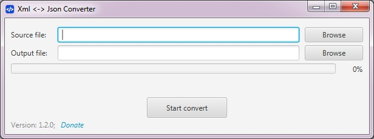

[](https://travis-ci.org/AntonMykolaienko/xml2json) [](https://sourceforge.net/projects/xml2json-converter/files/latest/download)
[](https://sonarcloud.io/dashboard?id=com.fs%3Axml2json-parent)
[](https://www.versioneye.com/user/projects/59eb28472de28c156fca6707)

Simple UI and Command line tool for converting large XML-files to JSON or JSON to XML, written on Java.

### Getting started
These instructions will get you a copy of the project up and running on your local machine for development and testing purposes. 

### Requirements
To build application from sources you will need following parts:
- Oracle JDK 1.8u40 (or just JRE to run binary application) or newer ([Download](http://www.oracle.com/technetwork/java/javase/downloads/index.html))
- Git ([Download](https://git-scm.com/downloads))
- Maven 3.x ([Download](https://maven.apache.org/download.cgi))


### Build from sources
- Clone the repo: `git clone https://github.com/AntonMykolaienko/xml2json.git`
- Build: `mvn clean install`
- Binary application (dmg, rpm or exe) can be found at `xml2json\target\os\distribution\xml2json`

### Binary packages
You can download binaries for desired platform at SourceForge ([Download](https://sourceforge.net/projects/xml2json-converter/))

### Startup options
Application have UI written on JavaFX. Starting from 1.2.0 version Xml2Json converter supports conversion via command line in batch. 
Tool supports following command line parameters:
- noGui - to indicate processing without GUI (Example: `--noGui`)
- sourceFolder - path to folder where source files placed (Example: `--sourceFolder=C:\Temp\Input`)
- destinationFolder - path to folder where converted files will be placed (Example: `--destinationFolder=C:\Temp\Output`)
- overwrite - to force overwrite converted files. Default: application will ask confirmation. (Example: `--overwrite`)

Examples:
1. Convert list of JSON-files:
	```
	java -jar xml2json-1.3.0-all.jar --noGui --sourceFolder=C:\Temp\Input \
	--destinationFolder=C:\Temp\Output --pattern=*.json
	```
2. Convert list of XML-files:
	```
	java -jar xml2json-1.3.0-all.jar --noGui --sourceFolder=C:\Temp\Input \
	--destinationFolder=C:\Temp\Output --pattern=*.xml
	```
3. Convert only one file :
	```
	java -jar xml2json-1.3.0-all.jar --noGui --sourceFolder=C:\Temp\Input \
	--destinationFolder=C:\Temp\Output --pattern=someFile.xml
	```
	
To start Tool with GUI just run following command: 
```
java -jar xml2json-1.3.0-all.jar
```

<br>Note: When you are starting tool in command line mode it will use all free memory which you have in your system, but if you need limit memory usage then you will need to add `-Xmx=512M` to your start command right after 'java':
```
java -Xmx=512M -jar xml2json-1.3.0-all.jar --noGui --sourceFolder=C:\Temp\Input \
--destinationFolder=C:\Temp\Output --pattern=someFile.xml
```


### Contributing

Please read [CONTRIBUTING.md](CONTRIBUTING.md) for details on code of conduct, and the process for submitting pull requests.


### Versioning

We use [SemVer](http://semver.org/) for versioning. For the versions available, see the [tags on this repository](https://github.com/AntonMykolaienko/xml2json/tags). 


### License
This project is licensed under the Apache 2.0 License - see the [LICENSE](LICENSE) file for details.


### Screenshots
 


### Donation
You can make donation via [PayPal](https://www.paypal.com/cgi-bin/webscr?cmd=_s-xclick&hosted_button_id=33R3LMBMX3R96)
